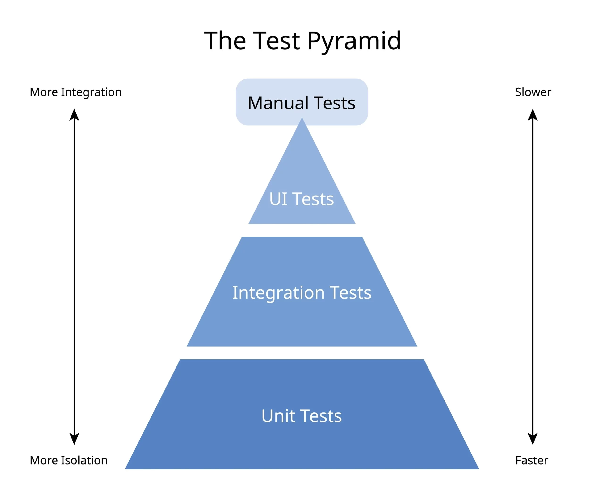

= Test in DEvelopment
:doctype: article
:toc:
:toclevels: 2

== Types of Tests in the Software Development Lifecycle

Software testing ensures the quality and reliability of applications. Here are the main types of tests, with examples:

=== 1. Unit Testing
Tests individual components or functions in isolation.
*Example:* Testing a function that calculates the sum of two numbers.

*The Benefits of Unit Tests*

- **Early Bug Detection:** Catch issues at the earliest stage of development.
- **Documentation:** Serve as documentation for the codebase.
- **Refactoring Support:** Facilitate safe code refactoring.
- **Design Feedback:** Encourage better code design and modularity.
- **Regression Prevention:** Ensure that new changes do not break existing functionality.
- **Faster Development Cycle:** Enable quicker feedback loops during development.
- **Confidence in Code Quality:** Increase confidence in the stability and reliability of the code.
- **Facilitate Collaboration:** Help teams understand code functionality and integration points.
- **Cost Efficiency:** Reduce the cost of fixing bugs by identifying them early.

- Unit tests can contribute to higher code quality
- Unit tests might contribute to better application architecture
- Detect code smells in your codebase

=== 2. Integration Testing
Verifies the interaction between integrated units or modules.
*Example:* Testing the communication between a database and a backend API.

*The Benefits of Integration Tests*

- **Early Detection of Interface Issues:** Identify problems in the interaction between components before they reach production.
- **Improved System Design:** Encourage developers to think about the system architecture and component interactions.
- **Reduced Risk of Regression:** Catch integration issues early, reducing the risk of regressions in future changes.
- **Increased Confidence in System Behavior:** Validate that integrated components work together as expected.
- **Facilitation of Continuous Integration:** Support CI/CD practices by ensuring that integrated components function correctly after each change.

=== 3. System Testing
Validates the complete and integrated software system against requirements.
*Example:* Running end-to-end tests on a web application.

=== 4. Acceptance Testing
Confirms the system meets business requirements and is ready for delivery.
*Example:* User Acceptance Testing (UAT) where end-users validate features.

=== 5. Regression Testing
Ensures new changes do not break existing functionality.
*Example:* Running automated test suites after adding a new feature.

=== 6. Smoke Testing
Basic tests to check if the major functionalities work after a build.
*Example:* Verifying that the application launches and main pages load.

=== 7. Sanity Testing
Quick checks to verify specific functionalities after minor changes.
*Example:* Testing a bug fix to ensure it works as expected.

=== 8. Performance Testing
Assesses the speed, responsiveness, and stability under load.
*Example:* Load testing a website with thousands of users.

=== 9. Security Testing
Identifies vulnerabilities and ensures data protection.
*Example:* Testing for SQL injection or cross-site scripting (XSS).

=== 10. Usability Testing
Evaluates the user interface and user experience.
*Example:* Observing users as they navigate the application.

=== 11. Compatibility Testing
Checks if the software works across different devices, browsers, or OS.
*Example:* Testing a mobile app on iOS and Android devices.

=== 12. Alpha and Beta Testing
Pre-release testing by internal teams (Alpha) and external users (Beta).
*Example:* Releasing a beta version to a group of users for feedback.

== Stub vs Mock vs Fake vs Spy

In testing, *Stub*, *Mock*, *Fake*, and *Spy* are types of test doubles used to isolate the code under test:

[cols="1,3",options="header"]
|===
|Type |Description

|Stub
|Provides predefined responses to method calls, typically used to control the behavior of dependencies.

|Mock
|Simulates objects and verifies interactions, such as whether a method was called with specific arguments.

|Fake
|Implements a working, but simplified, version of a dependency (e.g., an in-memory database).

|Spy
|Wraps a real object and records information about its usage, allowing both real behavior and verification.
|===

.Examples
* **Stub:** Returning a fixed value from a method for testing.
* **Mock:** Verifying that a logging function was called with the correct message.
* **Fake:** Using an in-memory repository instead of a real database.
* **Spy:** Checking how many times a function was called during a test.

*Stub*

A stub is a controllable replacement for an existing dependency (or collaborator) in the system. 
 
- By using a stub, you can test your code without dealing with the dependency directly. 
- Stub is an object that holds predefined data and uses it to answer calls during tests. Such as: an object that needs to grab some data from the database to respond to a method call. 

1. Provide specific answers to methods calls, ex: `myStubbedService.getValues() just return a String needed by the code under test`
2. Used by code under test to isolate it
3. Cannot fail test, ex: `myStubbedService.getValues() just returns the stubbed value`
4. Often implement abstract methods

*Mock*

A mock object is a fake object in the system that decides whether the unit test has passed or failed. 

- It does so by verifying whether the object under test interacted as expected with the fake object. 
- Mocks are objects that register calls they receive. In test assertion, we can verify on Mocks that all expected actions were performed. Such as: a functionality that calls e-mail sending service

1. "Superset" of stubs; can assert that certain methods are called, `ex: verify that myMockedService.getValues() is called only once`
2. Used to test behaviour of code under test
3. Can fail test, `ex: verify that myMockedService.getValues() was called once; verification fails, because myMockedService.getValues() was not called by my tested code`
4. Often mocks interfaces

*Spy*

Spies are stubs that also record some information based on how they were called. 

- One form of this might be an email service that records how many messages it was sent(also called Partial Mock).
- a dummy piece of code that intercepts and verifies some calls to real working code, avoiding the need to substitute all the real code.

*Fake*

Create a test implementation of a class which may have a dependency on some external infrastructure. (It's good practice that your unit test does NOT actually interact with external infrastructure.)

- Example: Create fake implementation for accessing a database, replace it with in-memory collection.